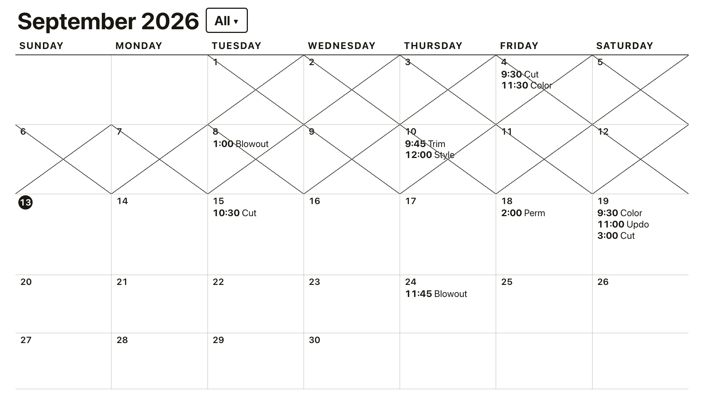

# Salon Calendar

## [**Live demo →**](https://saloncalendar.vercel.app/)

Sample data only, no login. Edits reset when you reload.

## The problem

Right now, when a customer calls, an employee writes their name and time
on a paper calendar — and every employee has their own physical calendar.
It works, but it means many separate copies in many places, no single view
of the whole salon, and it's one coffee spill away from lost bookings.

This digital calendar replaces all of those physical calendars with one
shared calendar that everyone can see, and that can still be filtered down
to any one employee's appointments.

Digital calendars (Google Calendar, etc.) aren't a real alternative here —
the staff using this aren't comfortable with them. Event dialogs,
timezones, invites, a separate login for every person: it's the wrong
tool for someone who just wants to write down a name and a time.

## Highlights

- **One shared calendar, zero accounts to manage.** Whoever answers the
  phone books it — everyone still connects with the same PIN, no per-employee
  logins. Appointments can optionally be tagged to an employee and the
  calendar filtered to just their day, but that's a filter on the one shared
  calendar, not separate logins or separate calendars.
- **One screen, like the paper calendar.** The month page on the left,
  the booking form always open on the right. Click a day, pick a time,
  write "Full set", save. No pop-ups, nothing to navigate.
- **Built for zero training.** Big tap targets, plain language, no jargon,
  no settings menus, nothing to configure.
- **Forgiving time entry, for people who aren't good with computers.** Type
  an appointment the way it's written on paper — "2:30 Full set" — and
  typos don't cost you the time, because the people using this shouldn't
  have to know or care about the "right" format. A semicolon (or two)
  instead of the colon (`2;30`, `2;;30`), no colon at all (`230`), no space
  before the note (`2:30Full set`), a dash between them, `p` or `p.m.`,
  even 24-hour time all read correctly, so every appointment stays in
  chronological order.
- **Live sync.** Book it on the front-desk computer, see it instantly on
  the owner's phone — no refreshing, no "did that save?"
- **Business-hours-aware.** The time list only offers times the salon is
  open, so there's no 2 AM appointment by accident.
- **Same-time appointments just work.** Multiple staff can each have a
  client at once — the app doesn't treat that as a conflict.
- **A PIN, not a password.** Connecting a device takes a 4-digit PIN,
  the kind everyone already knows from a debit card.
- **Installs like an app.** Add it to a home screen or desktop — no App
  Store, no download, and it updates itself.

## Tech stack

- **React + Vite**, styled with **Tailwind CSS**, motion via **Framer
  Motion** — following the same simple, single-screen design language as
  the `salon_menu` project.
- **Supabase** (Postgres + Auth + Realtime) for data storage, live sync
  across devices, and access control.
- Deployed as a static site on **Vercel**.
